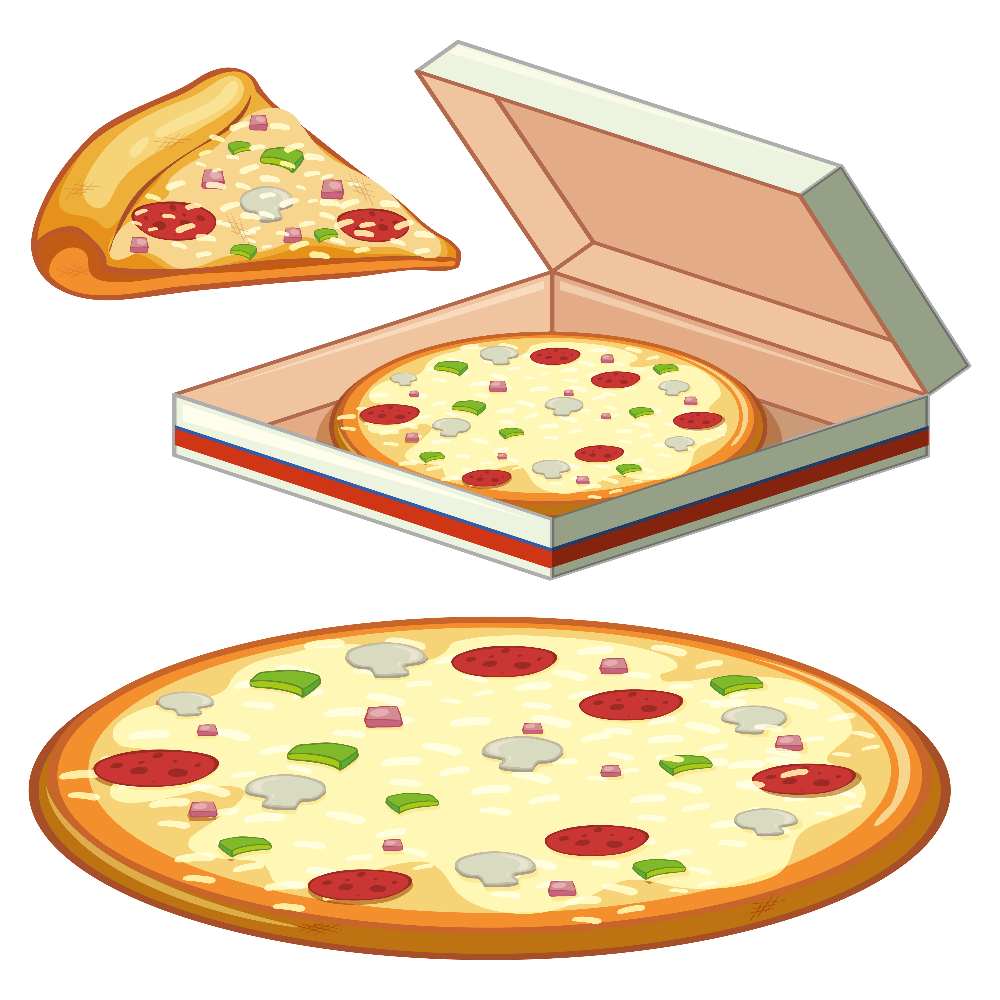
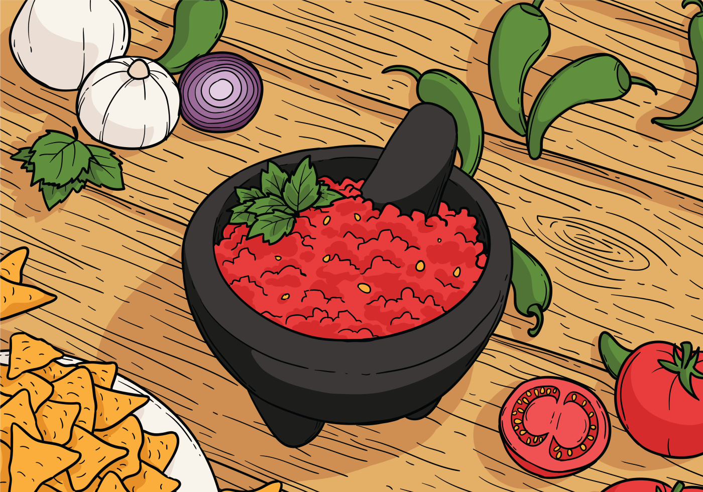
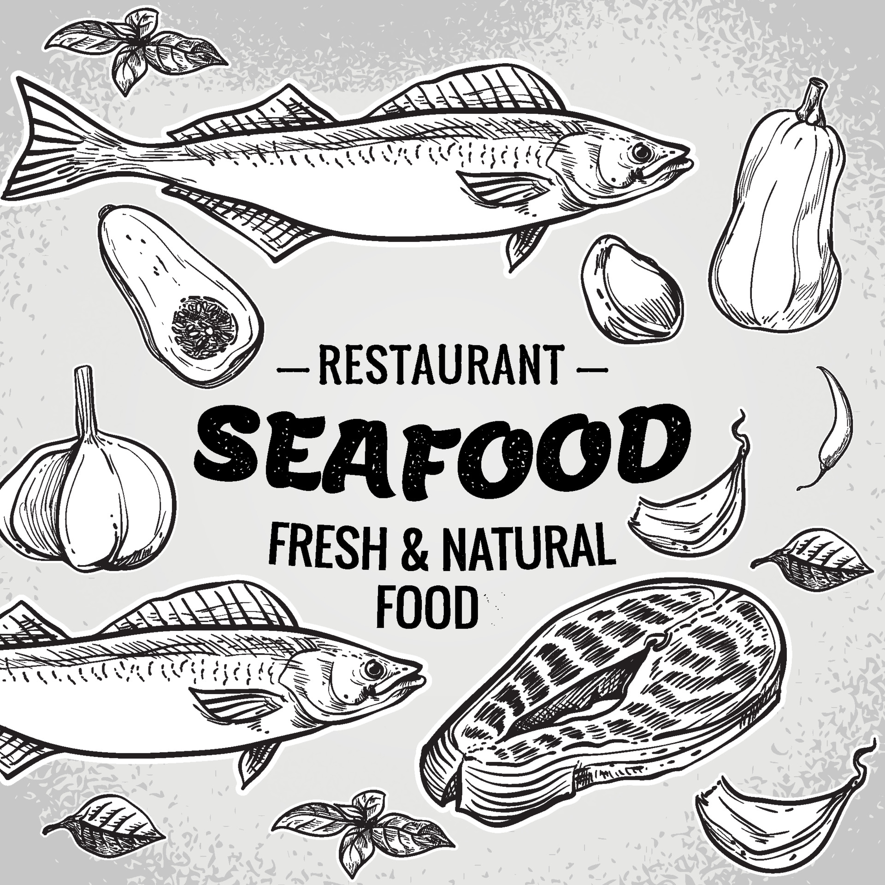

# Menu

## Pizze klasyczne

|Lp. |Pizza klasyczna:                                             |rozmiar: | 30 cm | 50 cm | 60 cm |
|---|--------------------------------------------------------------|---------|-------|-------|-------|
|1. |MARGGETITTA (sos pomidorowy, ser, oregano)|                             |20 zł | 23 | 27 |
|2. |KURCZAK (sos pomidorowy, kurczak, ser, oregano)|                        |22 zł | 25 | 28 |
|3. |4SERY (sos pomidorowy, 4sery)|                                          |24 zł | 27 | 30 |
|4. |SALAMI (sos pomidorowy, salami, ser)|                                   |20 zł | 23 | 31 |
|5. |HAWAJSKA (sos pomidorowy. ser, szynka, ananas)|                         |24 zł | 26 | 30 |
|6. |VESUBIO (sos pomidorowy, podwójny ser, szynka)|                         |25 zł | 28 | 32 |
|7. |MILANO (sos pomidorowy, ser, szynka, papryka i oregano)|                |26 zł | 29 | 31 |

## Pizze specialne

|Lp. |Pizza specjalne:                                                        |rozmiar: | 30 cm | 50 cm | 60 cm |
|---|-------------------------------------------------------------------------|---------|-------|-------|-------|
|8. |LECHA (sos pomidorowy,kabanos, szynka, ser, oregano)|                               | 27 zł | 30 zł | 33 zł |
|9. |WIEJSKA (sos pomidorowy, szynka, boczek, cebula, ser, oregano)|                     | 26 zł | 29 zł | 32 zł |
|10. |KEBAB (sos pomidorowy, baranina, kurczak, ser, oregano, sałata)|                   | 26 zł | 29 zł | 32 zł |
|11. |CDV (nauka, praktyki)|                                                             | 850 zł | 850 zł | 850 zł |

## Pizze wegetariańskie

|Lp. |Pizza klasyczna:                                             |rozmiar: | 30 cm | 50 cm | 60 cm |
|---|--------------------------------------------------------------|---------|-------|-------|-------|
|1. |MARGGETITTA (sos pomidorowy, ser, oregano)|                             |20 zł | 23 | 27 |                        |22 zł | 25 | 28 |
|3. |4SERY (sos pomidorowy, 4sery)|                                          |24 zł | 27 | 30 ||                                   |20 zł | 23 | 31 |
|5. |HAWAJSKA VEGE (sos pomidorowy, ser, ananas)|                         |24 zł | 26 | 30 |

## Sałaki

1.Cesar - 15 zł
2.Italiano - 20 zł
3.Grecka - 15 zł
4.Hiszpańska - 20 zł

## Napoje

1.Woda - 5zł
2.Cola - 5 zł
3.Soki - 5zł

## SOSY

- SALSA - 3 zł
- CZOSNKOWY - 3 zł
- CHILLY - 3 zł

## Dodatki

1. Cukinia - 5zł
2. Karczochy - 5zł
3. Krewetki - 20zł

